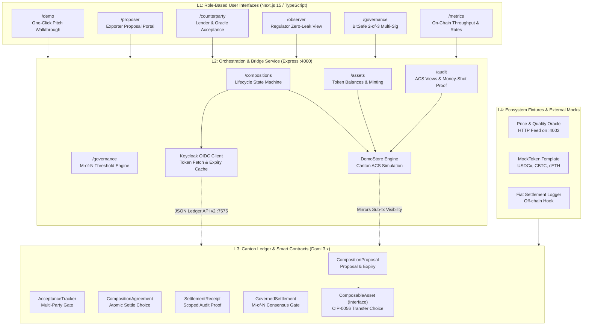
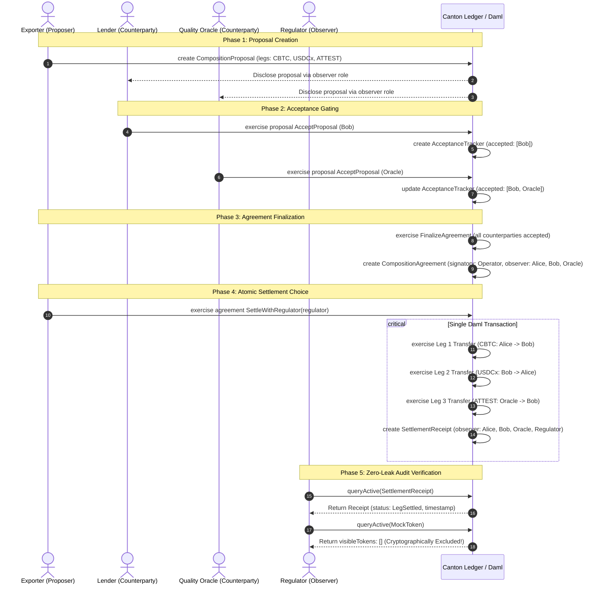
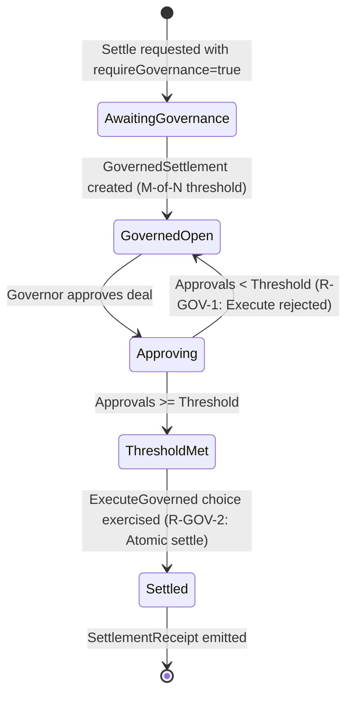

# Composition Protocol — Architectural Specification & Technical Blueprint

This document details the architectural design, security properties, transaction mechanics, and privacy boundaries of the **Composition Protocol**, an atomic, private, multi-asset settlement primitive built on Canton for HackCanton Season 3.

---

## 1. Architectural Overview & System Decomposition

Composition Protocol separates concerns into four distinct, loosely coupled layers:



---

## 2. Core Protocol Lifecycle & State Machine

The composition lifecycle transitions through four strictly ordered states, ensuring all counterparties co-sign before any asset movement occurs:



---

## 3. Cryptographic Privacy & Stakeholder Model (`R-PRIV-1/2/3`)

Traditional transparent blockchains require complex zero-knowledge (ZK) circuits to hide transaction details. On Canton, selective disclosure is enforced at the sub-transaction level via Daml’s **`signatory`** and **`observer`** access control model.

### 3.1 Stakeholder Matrix

| Contract / Payload | Signatories | Observers | Excluded Parties |
|:---|:---|:---|:---|
| **`CompositionProposal`** | Proposer, Operator | All required counterparties | Unrelated third parties, Regulators |
| **`AcceptanceTracker`** | Operator | Required counterparties | Regulators, non-participating nodes |
| **`CompositionAgreement`** | Operator | Proposer, All counterparties | Regulators, public network |
| **Leg 1: `CBTC` Token** | Operator, Exporter (Alice) | Lender (Bob) | Oracle, Regulator |
| **Leg 2: `USDCx` Token** | Operator, Lender (Bob) | Exporter (Alice) | Oracle, Regulator |
| **Leg 3: `ATTEST` Token** | Operator, Quality Oracle | Lender (Bob) | Exporter (Alice), Regulator |
| **`SettlementReceipt`** | Operator | All deal parties, **Regulator** | Non-disclosed external entities |

### 3.2 The "Money Shot" Architecture
- **Participant ACS (Bob):** Sees his inbound `CBTC` collateral, outbound `USDCx` debit, inbound `ATTEST` certificate, and the `SettlementReceipt`.
- **Observer ACS (Regulator):** Queries Canton's Active Contract Set (ACS) at the ledger end offset. Because `MockToken` instances declare only leg stakeholders, Canton's domain sequencer **never projects token contract data to the regulator's node**.
- **Audit Outcome:**
  ```text
  Regulator Active Contract Set (ACS) Query Result:
  ├── visibleTokens:        []        (0 token contracts disclosed — cryptographic exclusion)
  └── settlementReceipts:   [Receipt] (Immutable audit proof with timestamp and leg statuses)
  ```
  $$\text{Regulator ACS} \implies \{ \text{visibleTokens: []}, \; \text{settlementReceipts: [Receipt]} \}$$

---

## 4. Transaction Atomicity & Failure Modes (`R-ATOM-1/2`)

Atomicity is guaranteed by Daml’s deterministic execution engine rather than off-chain two-phase commit protocols:

```daml
choice SettleWithRegulator : ContractId SettlementReceipt
  with
    regulator : Party
  controller operator
  do
    now <- getTime
    -- R-ATOM-1: All transfers execute in this loop within one transaction.
    forA_ legs $ \leg -> do
      exercise leg.assetCid Transfer with newOwner = leg.receiver
    
    let summaries = map (\l -> LegSummary with
          legId = l.legId
          instrumentId = l.instrumentId
          status = LegSettled) legs
          
    create SettlementReceipt with
      operator
      participants = parties
      settledAt = now
      description
      legSummaries = summaries
      regulators = Set.fromList [regulator]
```

### Failure Guarantee
If Leg 2 fails (e.g., Lender Bob has insufficient `USDCx` balance or contract ID was double-spent):
1. The Daml execution engine traps the abort.
2. The transaction rolls back **100% of state changes**.
3. Alice retains her `CBTC` collateral contract; Oracle retains the `ATTEST` contract.
4. No intermediate or half-settled contract is ever committed to Canton's synchronization domain (`R-ATOM-2`).

---

## 5. BitSafe Decentralized Governance ($M$-of-$N$ Multi-Sig)

To satisfy the **BitSafe Decentralization Challenge**, high-value compositions can be wrapped inside a `GovernedSettlement` template:



### Threshold Invariants
- **`R-GOV-1` (Rejection Below Threshold):**
  ```daml
  assertMsg "below threshold — governed action must not execute"
    (Set.size approvals >= threshold)
  ```
  Calling `ExecuteGoverned` when approvals $< M$ triggers an explicit transaction failure.
- **`R-GOV-2` (Execution at Threshold):**
  Once approvals $\ge M$, `ExecuteGoverned` transitions the deal directly into `CompositionAgreement.SettleWithRegulator`, maintaining single-transaction atomicity.

---

## 6. Canton JSON Ledger API v2 Integration

The backend interacts with Canton via the modern JSON Ledger API v2:

| Operation | HTTP Endpoint | Payload Structure |
|:---|:---|:---|
| **Submit Command** | `POST /v2/commands/submit-and-wait` | `{ commands: { commandId, actAs, commands: [CreateCommand \| ExerciseCommand] } }` |
| **Get Ledger Offset** | `GET /v2/state/ledger-end` | Returns latest ledger offset string |
| **Query Active Contracts** | `POST /v2/state/active-contracts` | `{ filter: { filtersByParty: { [party]: { cumulative: [TemplateFilter] } } }, activeAtOffset }` |

### Dynamic OIDC Token Handling
When `LEDGER_MODE=ledger`, the backend dynamically acquires an access token from Keycloak:
- **Token Endpoint:** `https://keycloak.naas.noders.services/realms/noders-appsfactory/protocol/openid-connect/token`
- **Grant Type:** `password`
- **Audience:** `https://hackcanton-01.devnet.naas.noders.services`
- **Token Caching:** Automatically cached in memory and renewed 30 seconds prior to expiration.
