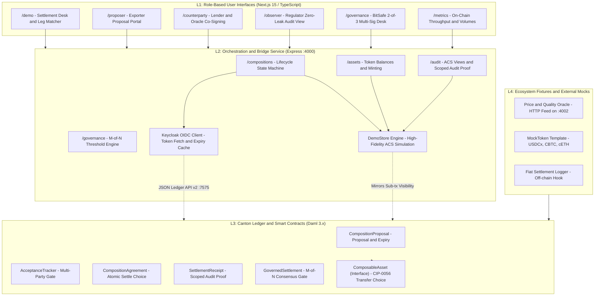
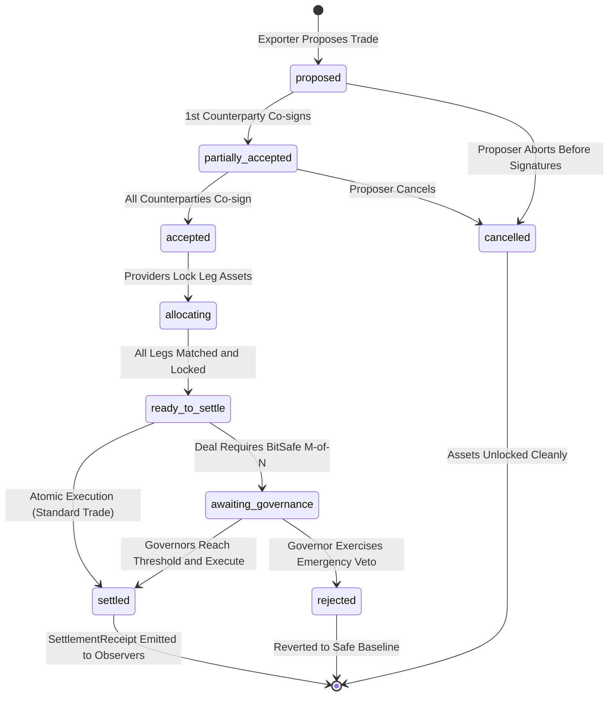
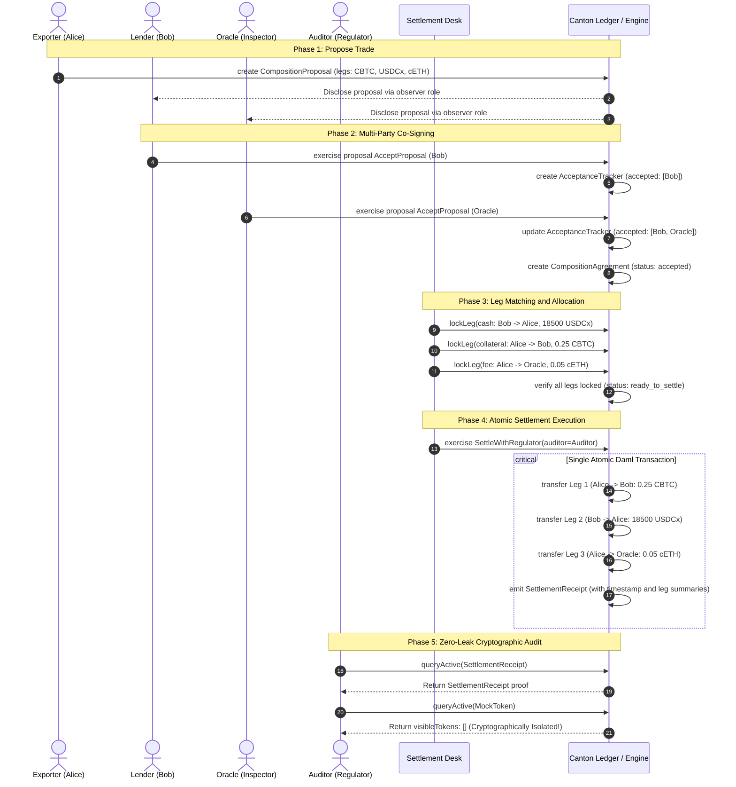
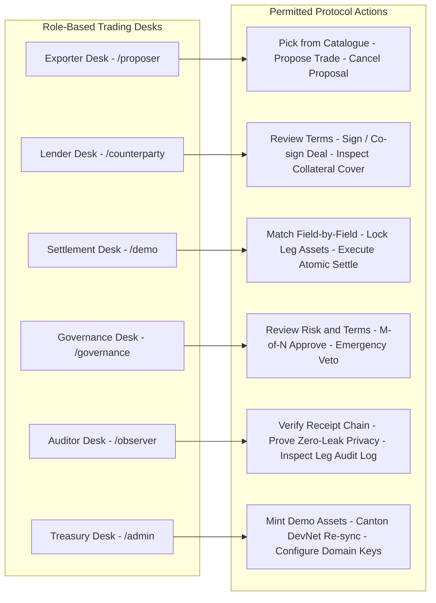
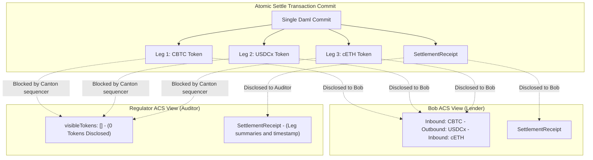
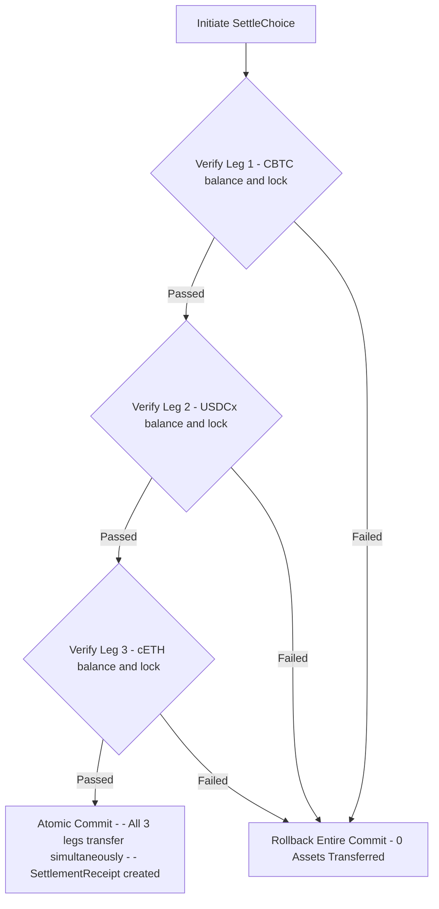
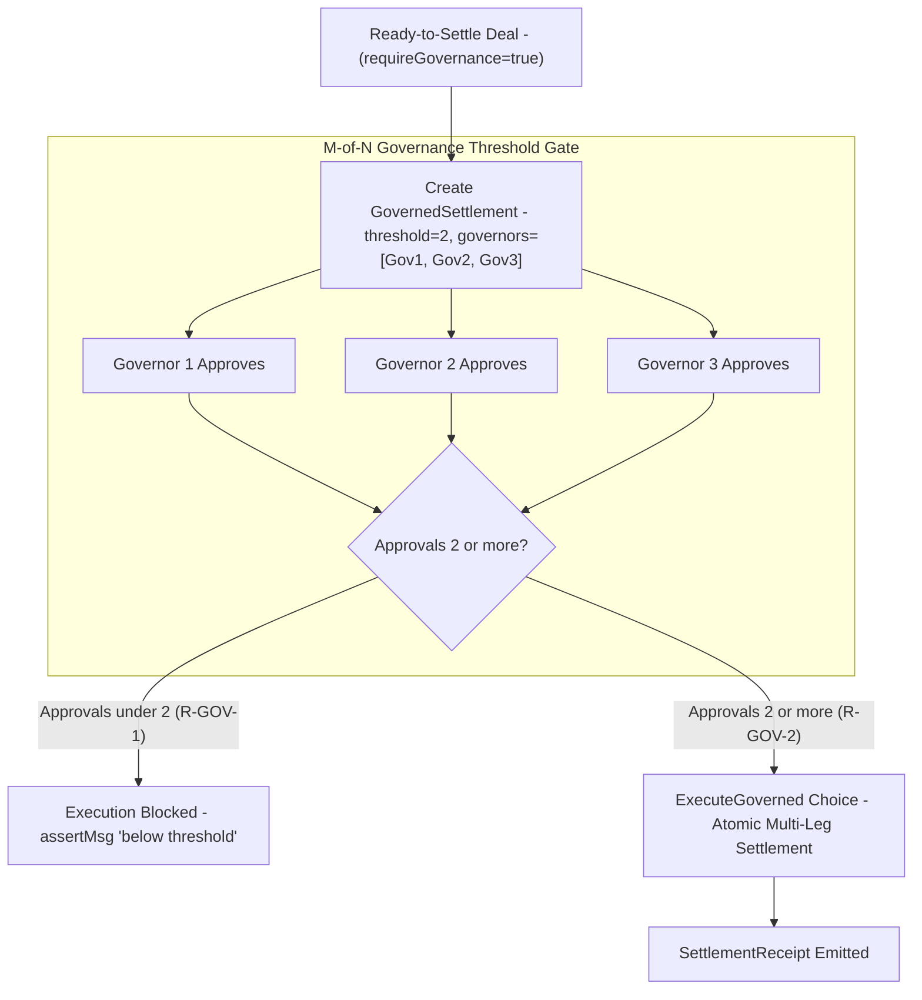
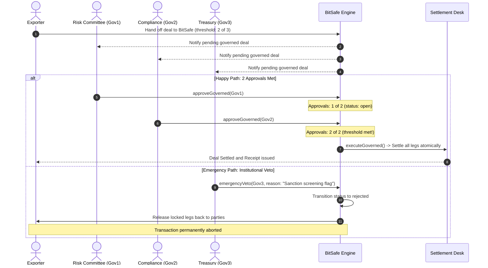
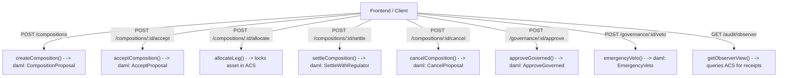
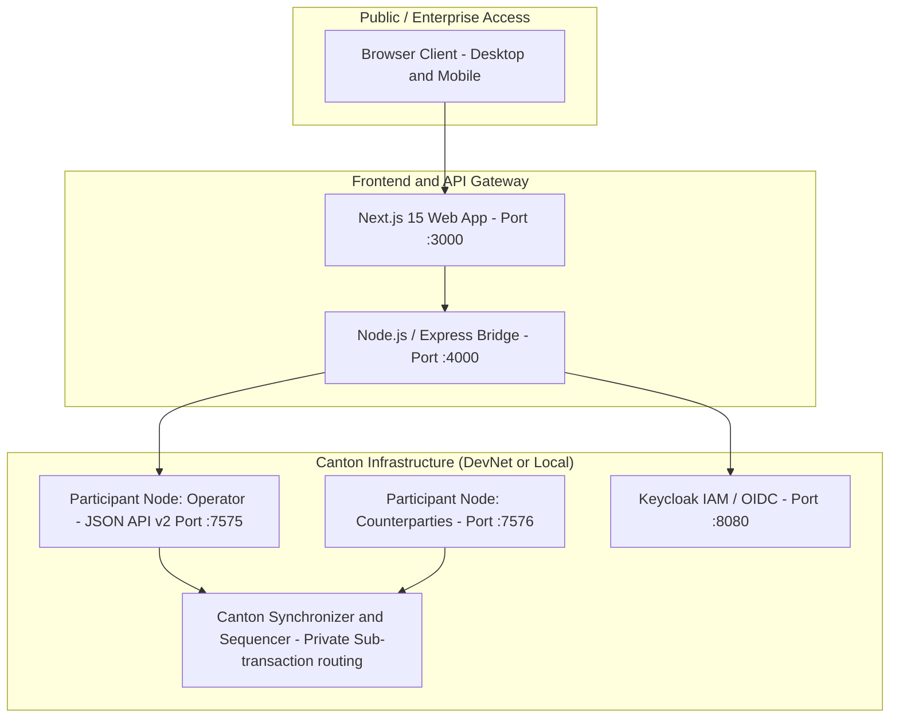

# Settleflow — Architectural Specification and Technical Blueprint

> **Version:** October 2026 Edition · HackCanton Season 3  
> **Status:** Production-Ready Architecture and In-Memory / Ledger v2 Implementation

This document details the complete architectural design, security properties, transaction mechanics, stakeholder privacy boundaries, and failure-mode guarantees of **Settleflow** — an atomic, private, multi-asset settlement coordination primitive built natively on Canton (Daml 3.x).

---

## Table of Contents

1. [System Overview and Decomposition](#1-system-overview--decomposition)
2. [Core Protocol Lifecycle and State Machine](#2-core-protocol-lifecycle--state-machine)
3. [Detailed Settlement Sequence](#3-detailed-settlement-sequence)
4. [Role-Based Desk Architecture](#4-role-based-desk-architecture)
5. [Cryptographic Privacy and Stakeholder Model](#5-cryptographic-privacy--stakeholder-model)
6. [Transaction Atomicity and Failure Modes](#6-transaction-atomicity--failure-modes)
7. [BitSafe M-of-N Governance Architecture](#7-bitsafe-m-of-n-governance-architecture)
8. [Governance Flow and Veto Paths](#8-governance-flow--veto-paths)
9. [Data Flow and API Integration Map](#9-data-flow--api-integration-map)
10. [Canton Ledger API v2 Integration](#10-canton-ledger-api-v2-integration)
11. [Deployment Topology](#11-deployment-topology)
12. [Security Threat Model](#12-security-threat-model)

---

## 1. System Overview and Decomposition

Settleflow separates concerns into four distinct, loosely coupled layers:


```mermaid
graph TD
    subgraph L1["L1: Role-Based User Interfaces (Next.js 15 / TypeScript)"]
        UI_DEMO["/demo - Settlement Desk and Leg Matcher"]
        UI_PROP["/proposer - Exporter Proposal Portal"]
        UI_CPTY["/counterparty - Lender and Oracle Co-Signing"]
        UI_OBS["/observer - Regulator Zero-Leak Audit View"]
        UI_GOV["/governance - BitSafe 2-of-3 Multi-Sig Desk"]
        UI_MET["/metrics - On-Chain Throughput and Volumes"]
    end

    subgraph L2["L2: Orchestration and Bridge Service (Express :4000)"]
        RT_COMP["/compositions - Lifecycle State Machine"]
        RT_ASSET["/assets - Token Balances and Minting"]
        RT_AUDIT["/audit - ACS Views and Scoped Audit Proof"]
        RT_GOV["/governance - M-of-N Threshold Engine"]
        MEM_STORE["DemoStore Engine - High-Fidelity ACS Simulation"]
        OIDC_MGR["Keycloak OIDC Client - Token Fetch and Expiry Cache"]
    end

    subgraph L3["L3: Canton Ledger and Smart Contracts (Daml 3.x)"]
        CONTRACT_PROP["CompositionProposal - Proposal and Expiry"]
        CONTRACT_TRACK["AcceptanceTracker - Multi-Party Gate"]
        CONTRACT_AGREE["CompositionAgreement - Atomic Settle Choice"]
        CONTRACT_RCPT["SettlementReceipt - Scoped Audit Proof"]
        CONTRACT_GOV["GovernedSettlement - M-of-N Consensus Gate"]
        IFACE_ASSET["ComposableAsset (Interface) - CIP-0056 Transfer Choice"]
    end

    subgraph L4["L4: Ecosystem Fixtures and External Mocks"]
        MOCK_ORACLE["Price and Quality Oracle - HTTP Feed on :4002"]
        MOCK_TOKEN["MockToken Template - USDCx, CBTC, cETH"]
        MOCK_FIAT["Fiat Settlement Logger - Off-chain Hook"]
    end

    UI_DEMO --> L2
    UI_PROP --> L2
    UI_CPTY --> L2
    UI_OBS --> L2
    UI_GOV --> L2
    UI_MET --> L2

    RT_COMP --> OIDC_MGR
    RT_COMP --> MEM_STORE
    RT_ASSET --> MEM_STORE
    RT_AUDIT --> MEM_STORE

    OIDC_MGR -.->|JSON Ledger API v2 :7575| L3
    MEM_STORE -.->|Mirrors Sub-tx Visibility| L3
    L3 --> IFACE_ASSET
    L4 --> L3
```

---

## 2. Core Protocol Lifecycle and State Machine

The composition lifecycle transitions through strictly verified states, ensuring all counterparties co-sign before any asset movement occurs:


```mermaid
stateDiagram-v2
    [*] --> proposed: Exporter Proposes Trade
    proposed --> partially_accepted: 1st Counterparty Co-signs
    partially_accepted --> accepted: All Counterparties Co-sign
    proposed --> cancelled: Proposer Aborts Before Signatures
    partially_accepted --> cancelled: Proposer Cancels
    accepted --> allocating: Providers Lock Leg Assets
    allocating --> ready_to_settle: All Legs Matched and Locked
    ready_to_settle --> settled: Atomic Execution (Standard Trade)
    ready_to_settle --> awaiting_governance: Deal Requires BitSafe M-of-N
    awaiting_governance --> settled: Governors Reach Threshold and Execute
    awaiting_governance --> rejected: Governor Exercises Emergency Veto
    settled --> [*]: SettlementReceipt Emitted to Observers
    cancelled --> [*]: Assets Unlocked Cleanly
    rejected --> [*]: Reverted to Safe Baseline
```

---

## 3. Detailed Settlement Sequence

The full lifecycle executes across distinct phases, transitioning seamlessly from negotiation to single-transaction finality:


```mermaid
sequenceDiagram
    autonumber
    actor Alice as Exporter (Alice)
    actor Bob as Lender (Bob)
    actor Oracle as Oracle (Inspector)
    actor Auditor as Auditor (Regulator)
    participant Desk as Settlement Desk
    participant Ledger as Canton Ledger / Engine

    Note over Alice,Ledger: Phase 1: Propose Trade
    Alice->>Ledger: create CompositionProposal (legs: CBTC, USDCx, cETH)
    Ledger-->>Bob: Disclose proposal via observer role
    Ledger-->>Oracle: Disclose proposal via observer role

    Note over Bob,Ledger: Phase 2: Multi-Party Co-Signing
    Bob->>Ledger: exercise proposal AcceptProposal (Bob)
    Ledger->>Ledger: create AcceptanceTracker (accepted: [Bob])
    Oracle->>Ledger: exercise proposal AcceptProposal (Oracle)
    Ledger->>Ledger: update AcceptanceTracker (accepted: [Bob, Oracle])
    Ledger->>Ledger: create CompositionAgreement (status: accepted)

    Note over Desk,Ledger: Phase 3: Leg Matching and Allocation
    Desk->>Ledger: lockLeg(cash: Bob -> Alice, 18500 USDCx)
    Desk->>Ledger: lockLeg(collateral: Alice -> Bob, 0.25 CBTC)
    Desk->>Ledger: lockLeg(fee: Alice -> Oracle, 0.05 cETH)
    Ledger->>Ledger: verify all legs locked (status: ready_to_settle)

    Note over Desk,Ledger: Phase 4: Atomic Settlement Execution
    Desk->>Ledger: exercise SettleWithRegulator(auditor=Auditor)
    critical Single Atomic Daml Transaction
        Ledger->>Ledger: transfer Leg 1 (Alice -> Bob: 0.25 CBTC)
        Ledger->>Ledger: transfer Leg 2 (Bob -> Alice: 18500 USDCx)
        Ledger->>Ledger: transfer Leg 3 (Alice -> Oracle: 0.05 cETH)
        Ledger->>Ledger: emit SettlementReceipt (with timestamp and leg summaries)
    end

    Note over Auditor,Ledger: Phase 5: Zero-Leak Cryptographic Audit
    Auditor->>Ledger: queryActive(SettlementReceipt)
    Ledger-->>Auditor: Return SettlementReceipt proof
    Auditor->>Ledger: queryActive(MockToken)
    Ledger-->>Auditor: Return visibleTokens: [] (Cryptographically Isolated!)
```

---

## 4. Role-Based Desk Architecture

Each stakeholder in Settleflow operates within a purpose-built workspace adhering strictly to their permission boundaries:


```mermaid
graph LR
    subgraph Desks["Role-Based Trading Desks"]
        D1["Exporter Desk - /proposer"]
        D2["Lender Desk - /counterparty"]
        D3["Settlement Desk - /demo"]
        D4["Governance Desk - /governance"]
        D5["Auditor Desk - /observer"]
        D6["Treasury Desk - /admin"]
    end

    subgraph Actions["Permitted Protocol Actions"]
        A1["Pick from Catalogue - Propose Trade - Cancel Proposal"]
        A2["Review Terms - Sign / Co-sign Deal - Inspect Collateral Cover"]
        A3["Match Field-by-Field - Lock Leg Assets - Execute Atomic Settle"]
        A4["Review Risk and Terms - M-of-N Approve - Emergency Veto"]
        A5["Verify Receipt Chain - Prove Zero-Leak Privacy - Inspect Leg Audit Log"]
        A6["Mint Demo Assets - Canton DevNet Re-sync - Configure Domain Keys"]
    end

    D1 --> A1
    D2 --> A2
    D3 --> A3
    D4 --> A4
    D5 --> A5
    D6 --> A6
```

---

## 5. Cryptographic Privacy and Stakeholder Model (`R-PRIV-1/2/3`)

Traditional blockchains require complex zero-knowledge (ZK) circuits to hide transaction details. On Canton, selective disclosure is enforced at the sub-transaction level via Daml’s **`signatory`** and **`observer`** access control model.

### 5.1 Stakeholder Matrix

| Contract / Payload | Signatories | Observers | Cryptographically Excluded Parties |
|:---|:---|:---|:---|
| **`CompositionProposal`** | Proposer, Operator | All required counterparties | Unrelated third parties, Regulators |
| **`AcceptanceTracker`** | Operator | Required counterparties | Regulators, non-participating nodes |
| **`CompositionAgreement`** | Operator | Proposer, All counterparties | Regulators, public network |
| **Leg 1: `CBTC` Token** | Operator, Exporter (Alice) | Lender (Bob) | Oracle, Regulator |
| **Leg 2: `USDCx` Token** | Operator, Lender (Bob) | Exporter (Alice) | Oracle, Regulator |
| **Leg 3: `cETH` Token** | Operator, Quality Oracle | Lender (Bob) | Exporter (Alice), Regulator |
| **`SettlementReceipt`** | Operator | All deal parties, **Regulator** | Non-disclosed external entities |

### 5.2 The "Money Shot" Architecture


```mermaid
graph TD
    subgraph DealExecution["Atomic Settle Transaction Commit"]
        TX["Single Daml Commit"]
        L1["Leg 1: CBTC Token"]
        L2["Leg 2: USDCx Token"]
        L3["Leg 3: cETH Token"]
        RCPT["SettlementReceipt"]
        TX --> L1
        TX --> L2
        TX --> L3
        TX --> RCPT
    end

    subgraph BobACS["Bob ACS View (Lender)"]
        B_TOK["Inbound: CBTC - Outbound: USDCx - Inbound: cETH"]
        B_RCPT["SettlementReceipt"]
    end

    subgraph RegACS["Regulator ACS View (Auditor)"]
        R_TOK["visibleTokens: [] - (0 Tokens Disclosed)"]
        R_RCPT["SettlementReceipt - (Leg summaries and timestamp)"]
    end

    L1 -.->|Disclosed to Bob| B_TOK
    L2 -.->|Disclosed to Bob| B_TOK
    L3 -.->|Disclosed to Bob| B_TOK
    RCPT -.->|Disclosed to Bob| B_RCPT

    L1 -.->|Blocked by Canton sequencer| R_TOK
    L2 -.->|Blocked by Canton sequencer| R_TOK
    L3 -.->|Blocked by Canton sequencer| R_TOK
    RCPT -.->|Disclosed to Auditor| R_RCPT
```

- **Participant ACS (Bob):** Sees his inbound `CBTC` collateral, outbound `USDCx` debit, inbound `cETH` sponsor asset, and the `SettlementReceipt`.
- **Observer ACS (Regulator):** Queries Canton's Active Contract Set (ACS) at the ledger end offset. Because `MockToken` instances declare only leg stakeholders, Canton's domain sequencer **never projects token contract data to the regulator's node**.
- **Audit Outcome:**
  ```text
  Regulator Active Contract Set (ACS) Query Result:
  ├── visibleTokens:        []        (0 token contracts disclosed — cryptographic exclusion)
  └── settlementReceipts:   [Receipt] (Immutable audit proof with timestamp and leg statuses)
  ```

---

## 6. Transaction Atomicity and Failure Modes (`R-ATOM-1/2`)

Atomicity is guaranteed by Daml’s deterministic execution engine rather than off-chain two-phase commit protocols:

```daml
choice SettleWithRegulator : ContractId SettlementReceipt
  with
    regulator : Party
  controller operator
  do
    now <- getTime
    -- R-ATOM-1: All transfers execute in this loop within one transaction.
    forA_ legs $ \leg -> do
      exercise leg.assetCid Transfer with newOwner = leg.receiver
    
    let summaries = map (\l -> LegSummary with
          legId = l.legId
          instrumentId = l.instrumentId
          status = LegSettled) legs
          
    create SettlementReceipt with
      operator
      participants = parties
      settledAt = now
      description
      legSummaries = summaries
      regulators = Set.fromList [regulator]
```

### Failure Guarantee and Rollback Mechanics

If Leg 2 fails (e.g., Lender Bob has insufficient `USDCx` balance or contract ID was double-spent):
1. The Daml execution engine traps the abort.
2. The transaction rolls back **100% of state changes**.
3. Alice retains her `CBTC` collateral contract; Oracle retains the `cETH` contract.
4. No intermediate or half-settled contract is ever committed to Canton's synchronization domain (`R-ATOM-2`).


```mermaid
graph TD
    START["Initiate SettleChoice"] --> V1{"Verify Leg 1 - CBTC balance and lock"}
    V1 -- Passed --> V2{"Verify Leg 2 - USDCx balance and lock"}
    V1 -- Failed --> ABORT["Rollback Entire Commit - 0 Assets Transferred"]
    V2 -- Passed --> V3{"Verify Leg 3 - cETH balance and lock"}
    V2 -- Failed --> ABORT
    V3 -- Passed --> COMMIT["Atomic Commit - - All 3 legs transfer simultaneously - - SettlementReceipt created"]
    V3 -- Failed --> ABORT
```

---

## 7. BitSafe M-of-N Governance Architecture

To satisfy the **BitSafe Decentralization Challenge**, institutional and high-value compositions are governed by an $M$-of-$N$ threshold multi-sig mechanism:


```mermaid
graph TD
    PROP["Ready-to-Settle Deal - (requireGovernance=true)"] --> GOV_CREATE["Create GovernedSettlement - threshold=2, governors=[Gov1, Gov2, Gov3]"]
    
    subgraph MultiSig["M-of-N Governance Threshold Gate"]
        GOV_CREATE --> S1["Governor 1 Approves"]
        GOV_CREATE --> S2["Governor 2 Approves"]
        GOV_CREATE --> S3["Governor 3 Approves"]
        
        S1 --> COUNT{"Approvals 2 or more?"}
        S2 --> COUNT
        S3 --> COUNT
    end

    COUNT -- "Approvals under 2 (R-GOV-1)" --> BLOCKED["Execution Blocked - assertMsg 'below threshold'"]
    COUNT -- "Approvals 2 or more (R-GOV-2)" --> EXEC["ExecuteGoverned Choice - Atomic Multi-Leg Settlement"]
    EXEC --> FINAL["SettlementReceipt Emitted"]
```

### Threshold Invariants

- **`R-GOV-1` (Rejection Below Threshold):**
  ```daml
  assertMsg "below threshold — governed action must not execute"
    (Set.size approvals threshold met)
  ```
  Calling `ExecuteGoverned` when approvals $< M$ triggers an explicit transaction failure.
- **`R-GOV-2` (Execution at Threshold):**
  Once approvals $\ge M$, `ExecuteGoverned` transitions the deal directly into `CompositionAgreement.SettleWithRegulator`, maintaining single-transaction atomicity.

---

## 8. Governance Flow and Veto Paths

Institutional risk management requires explicit emergency intervention capabilities:


```mermaid
sequenceDiagram
    autonumber
    actor Alice as Exporter
    actor Gov1 as Risk Committee (Gov1)
    actor Gov2 as Compliance (Gov2)
    actor Gov3 as Treasury (Gov3)
    participant GovEngine as BitSafe Engine
    participant SettleDesk as Settlement Desk

    Alice->>GovEngine: Hand off deal to BitSafe (threshold: 2 of 3)
    GovEngine-->>Gov1: Notify pending governed deal
    GovEngine-->>Gov2: Notify pending governed deal
    GovEngine-->>Gov3: Notify pending governed deal

    alt Happy Path: 2 Approvals Met
        Gov1->>GovEngine: approveGoverned(Gov1)
        Note over GovEngine: Approvals: 1 of 2 (status: open)
        Gov2->>GovEngine: approveGoverned(Gov2)
        Note over GovEngine: Approvals: 2 of 2 (threshold met!)
        GovEngine->>SettleDesk: executeGoverned() -> Settle all legs atomically
        SettleDesk-->>Alice: Deal Settled and Receipt issued
    else Emergency Path: Institutional Veto
        Gov3->>GovEngine: emergencyVeto(Gov3, reason: "Sanction screening flag")
        GovEngine->>GovEngine: Transition status to rejected
        GovEngine->>Alice: Release locked legs back to parties
        Note over GovEngine,Alice: Transaction permanently aborted
    end
```

---

## 9. Data Flow and API Integration Map

The Settleflow bridge service exposes clean REST endpoints abstracting Daml choices:


```mermaid
graph TD
    CLI["Frontend / Client"] -->|POST /compositions| EP1["createComposition() - -> daml: CompositionProposal"]
    CLI -->|POST /compositions/:id/accept| EP2["acceptComposition() - -> daml: AcceptProposal"]
    CLI -->|POST /compositions/:id/allocate| EP3["allocateLeg() - -> locks asset in ACS"]
    CLI -->|POST /compositions/:id/settle| EP4["settleComposition() - -> daml: SettleWithRegulator"]
    CLI -->|POST /compositions/:id/cancel| EP5["cancelComposition() - -> daml: CancelProposal"]
    CLI -->|POST /governance/:id/approve| EP6["approveGoverned() - -> daml: ApproveGoverned"]
    CLI -->|POST /governance/:id/veto| EP7["emergencyVeto() - -> daml: EmergencyVeto"]
    CLI -->|GET /audit/observer| EP8["getObserverView() - -> queries ACS for receipts"]
```

---

## 10. Canton Ledger API v2 Integration

The backend interacts with Canton via the modern JSON Ledger API v2:

| Operation | HTTP Endpoint | Payload Structure |
|:---|:---|:---|
| **Submit Command** | `POST /v2/commands/submit-and-wait` | `{ commands: { commandId, actAs, commands: [CreateCommand, ExerciseCommand] } }` |
| **Get Ledger Offset** | `GET /v2/state/ledger-end` | Returns latest ledger offset string |
| **Query Active Contracts** | `POST /v2/state/active-contracts` | `{ filter: { filtersByParty: { [party]: { cumulative: [TemplateFilter] } } }, activeAtOffset }` |

### Dynamic OIDC Token Handling
When `LEDGER_MODE=ledger`, the backend dynamically acquires an access token from Keycloak:
- **Token Endpoint:** `https://keycloak.naas.noders.services/realms/noders-appsfactory/protocol/openid-connect/token`
- **Grant Type:** `password`
- **Audience:** `https://hackcanton-01.devnet.naas.noders.services`
- **Token Caching:** Automatically cached in memory and renewed 30 seconds prior to expiration.

---

## 11. Deployment Topology

Settleflow deploys cleanly across heterogeneous environments, from local developer stacks to Canton DevNet:


```mermaid
graph TD
    subgraph Internet["Public / Enterprise Access"]
        USER["Browser Client - Desktop and Mobile"]
    end

    subgraph DMZ["Frontend and API Gateway"]
        NEXT["Next.js 15 Web App - Port :3000"]
        API["Node.js / Express Bridge - Port :4000"]
    end

    subgraph Core["Canton Infrastructure (DevNet or Local)"]
        PART1["Participant Node: Operator - JSON API v2 Port :7575"]
        PART2["Participant Node: Counterparties - Port :7576"]
        SEQ["Canton Synchronizer and Sequencer - Private Sub-transaction routing"]
        IDP["Keycloak IAM / OIDC - Port :8080"]
    end

    USER --> NEXT
    NEXT --> API
    API --> IDP
    API --> PART1
    PART1 --> SEQ
    PART2 --> SEQ
```

---

## 12. Security Threat Model

A systematic STRIDE analysis demonstrates how Canton and Settleflow mitigate common decentralized finance vulnerabilities:

| Threat Category | Attack Vector | Settleflow Mitigation |
|:---|:---|:---|
| **Spoofing** | Impersonating Alice to propose rogue trades | Canton cryptographic party allocation with OIDC bearer JWTs. Only authentic holder of private key can act as party. |
| **Tampering** | Modifying trade amounts after Bob's approval | Daml immutability. Once accepted, `CompositionAgreement` parameters are frozen; changing terms requires recreating proposal. |
| **Repudiation** | Denying participation in settled DvP deal | `SettlementReceipt` signed by Operator with explicit participant list permanently logged on Canton ACS. |
| **Information Disclosure** | Front-running trade or spying on balances | Canton sub-transaction privacy. Observers receive only `SettlementReceipt`; token contracts are never synced to third parties. |
| **Denial of Service** | Flooding proposals or locking counterparties | Expiry deadlines (`allocateBy`, `settleBy`) and proposer cancellation endpoints allow clean liquidation of stalled negotiations. |
| **Elevation of Privilege** | Counterparty executing settlement single-handedly | Settle choices restricted to authorized Operator or governed multi-sig consensus threshold. |
