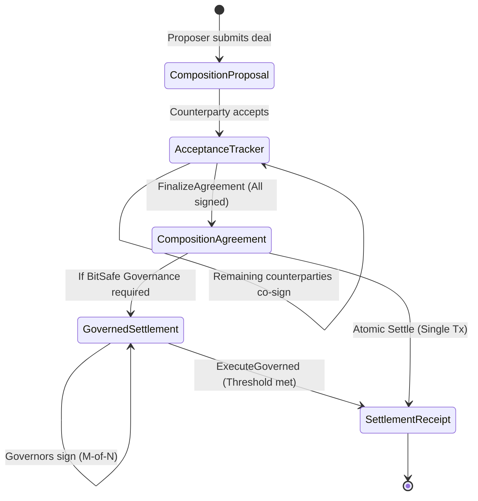

# Composition Protocol — Protocol Interface (PI) & Daml Specification

The **Composition Protocol** is a native, reusable smart contract primitive on Canton that provides **atomic, private, multi-asset settlement**. This document specifies the Protocol Interface (PI), Daml contract schemas, Canton participant integration patterns, and cryptographic privacy guarantees.

---

## 1. Protocol Architecture & Invariants

| ID | Invariant Category | Specification Rule |
| :--- | :--- | :--- |
| **R-ATOM-1** | Atomicity | All transfer legs execute within a single Daml transaction. If any leg fails, the entire transaction aborts. |
| **R-ATOM-2** | Revert Integrity | Aborted transactions produce zero state changes; no escrow locks or partial transfers exist on ledger. |
| **R-PRIV-1** | Per-Leg Privacy | Transferred asset tokens are only disclosed to the specific leg provider and receiver. |
| **R-PRIV-2** | Scoped Audit | Regulators observe `SettlementReceipt` metadata and leg statuses, but never underlying asset contract payloads. |
| **R-PRIV-3** | Money-Shot Invariant | In audit queries, the regulator Active Contract Set (ACS) has `visibleTokens: []`. |
| **R-GOV-1** | Governed Safety | Governed deals strictly reject execution when approved signatures are strictly less than threshold $M$. |
| **R-GOV-2** | Governed Execution | Governed deals execute atomic settlement once threshold $M$-of-$N$ is satisfied. |

---

## 2. Daml Protocol Interfaces

### 2.1 CIP-0056 Composable Asset Interface (`ComposableAsset.daml`)

Any fungible or non-fungible asset standard implementing `ComposableAsset` can be scheduled into an atomic composition deal.

```daml
module ComposableAsset where

data ComposableAssetView = ComposableAssetView with
    owner : Party
    instrumentId : Text
    amount : Decimal
  deriving (Eq, Show)

data TransferResult = TransferResult with
    newAssetCid : ContractId ComposableAsset
  deriving (Eq, Show)

interface ComposableAsset where
  viewtype ComposableAssetView

  choice Transfer : TransferResult
    with
      newOwner : Party
    controller (view this).owner
```

- **`Transfer` Choice:** Consumes the active token contract and creates a new token contract owned by `newOwner`.
- **Authorization:** Only the current `owner` possesses controller authority to transfer the asset.

---

### 2.2 Leg Specification Data Type

Each leg in a multi-asset deal is parameterized by `LegSpec`:

```daml
data LegSpec = LegSpec with
    legId : Text
    instrumentId : Text
    amount : Decimal
    provider : Party
    receiver : Party
    assetCid : ContractId ComposableAsset
  deriving (Eq, Show)
```

- `legId`: Unique identifier for the leg (e.g. `"collateral"`, `"cash"`, `"attestation"`).
- `instrumentId`: Asset symbol or ticker (e.g. `"CBTC"`, `"USDCx"`, `"ATTEST"`).
- `amount`: Decimal quantity transferred.
- `provider`: Debtor party transferring the asset.
- `receiver`: Beneficiary party receiving the asset.
- `assetCid`: Active interface contract ID of the asset token to be transferred.

---

### 2.3 Deal Lifecycle Contracts (`Composition.daml`)



#### Template: `CompositionProposal`
Proposes an atomic composition among $N$ counterparties.
- **Signatories:** `proposer`, `operator`
- **Observers:** `counterparties`
- **Preconditions:** Minimum 2 legs, minimum 1 counterparty.

#### Template: `AcceptanceTracker`
Accumulates cryptographic co-signatures from each required counterparty.
- **Signatories:** `operator`
- **Observers:** `required` parties
- **Choice:** `RecordAcceptance` (adds counterparty to `accepted` set).
- **Choice:** `FinalizeAgreement` (requires `Set.isSubsetOf required accepted`).

#### Template: `CompositionAgreement`
Co-signed multi-lateral deal ready for atomic ledger execution.
- **Signatories:** `operator`
- **Observers:** `parties` (proposer + all counterparties)
- **Choice: `Settle`:**
  ```daml
  choice Settle : ContractId SettlementReceipt
    controller operator
    do
      now <- getTime
      -- R-ATOM-1: All transfers executed in single atomic Daml transaction
      forA_ legs $ \leg -> do
        exercise leg.assetCid Transfer with newOwner = leg.receiver
      let summaries = map (\l -> LegSummary with
            legId = l.legId
            instrumentId = l.instrumentId
            status = LegSettled) legs
      create SettlementReceipt with
        operator
        participants = parties
        settledAt = now
        description
        legSummaries = summaries
        regulators = Set.empty
  ```

#### Template: `SettlementReceipt`
Immutable proof of successful atomic execution.
- **Signatories:** `operator`
- **Observers:** `participants ++ regulators`
- **Payload:** `settledAt` timestamp, `legSummaries` (`legId`, `instrumentId`, `status`), and metadata.
- **Privacy Note:** `SettlementReceipt` contains NO contract IDs or internal balances of the underlying asset tokens.

---

### 2.4 BitSafe M-of-N Governance (`Governance.daml`)

For institutional or high-value settlements, settlement authority is gated behind an $M$-of-$N$ threshold multi-signature committee:

```daml
template GovernedSettlement
  with
    operator : Party
    agreementCid : ContractId CompositionAgreement
    governors : Set Party
    threshold : Int
    approvals : Set Party
    regulator : Party
  where
    signatory operator
    observer Set.toList governors
    ensure
      threshold >= 1
      && threshold <= Set.size governors
      && Set.size governors >= 1

    choice ApproveGoverned : ContractId GovernedSettlement
      with
        governor : Party
      controller operator, governor
      do
        assertMsg "not a named governor" (Set.member governor governors)
        assertMsg "already approved" (not (Set.member governor approvals))
        create GovernedSettlement with
          operator
          agreementCid
          governors
          threshold
          approvals = Set.insert governor approvals
          regulator

    choice ExecuteGoverned : ContractId SettlementReceipt
      controller operator
      do
        assertMsg "below threshold — governed action must not execute"
          (Set.size approvals >= threshold)
        exercise agreementCid SettleWithRegulator with regulator

    -- | Institutional Emergency Veto: Allows named governor to abort an open deal
    choice EmergencyVeto : ()
      with
        governor : Party
        reason : Text
      controller operator, governor
      do
        assertMsg "not a named governor" (Set.member governor governors)
        pure ()

-- | Institutional Safety: Protocol Circuit Breaker for emergency halts
template ProtocolCircuitBreaker
  with
    operator : Party
    governors : Set Party
    isHalted : Bool
    haltReason : Optional Text
  where
    signatory operator
    observer Set.toList governors

    choice TriggerEmergencyHalt : ContractId ProtocolCircuitBreaker
      with
        governor : Party
        reason : Text
      controller operator, governor
      do
        assertMsg "not a named governor" (Set.member governor governors)
        create this with
          isHalted = True
          haltReason = Some reason

    choice ResumeProtocol : ContractId ProtocolCircuitBreaker
      with
        governor : Party
      controller operator, governor
      do
        assertMsg "not a named governor" (Set.member governor governors)
        create this with
          isHalted = False
          haltReason = None
```

---

## 3. Canton Participant Integration (PI)

### 3.1 JSON Ledger API v2 Wire Protocol

The backend connects to Canton participant nodes using Canton's JSON Ledger API v2 standard.

#### Endpoint: Command Submission (`/v2/commands/submit-and-wait`)
Submits a command batch and awaits consensus confirmation.
```http
POST /v2/commands/submit-and-wait HTTP/1.1
Host: ledger-api-json.participant.hackcanton-01.devnet.naas.noders.services
Content-Type: application/json
Authorization: Bearer <Keycloak_JWT_Token>

{
  "commands": {
    "commandId": "ex-Settle-1727181000",
    "actAs": ["Operator"],
    "commands": [
      {
        "ExerciseCommand": {
          "templateId": {
            "packageId": "<composition_dar_package_id>",
            "moduleName": "Composition",
            "entityName": "CompositionAgreement"
          },
          "contractId": "<agreement_contract_id>",
          "choice": "SettleWithRegulator",
          "choiceArgument": {
            "regulator": "Regulator"
          }
        }
      }
    ]
  }
}
```

#### Endpoint: Active Contract Set Query (`/v2/state/active-contracts`)
Performs party-scoped Active Contract Set (ACS) queries at a specific ledger offset:
```http
POST /v2/state/active-contracts HTTP/1.1
Host: ledger-api-json.participant.hackcanton-01.devnet.naas.noders.services
Content-Type: application/json
Authorization: Bearer <Keycloak_JWT_Token>

{
  "filter": {
    "filtersByParty": {
      "Regulator": {
        "cumulative": [
          {
            "identifierFilter": {
              "TemplateFilter": {
                "value": {
                  "templateId": "#composition:Composition:SettlementReceipt",
                  "includeCreatedEventBlob": false
                }
              }
            }
          }
        ]
      }
    }
  },
  "activeAtOffset": "000000000000000100"
}
```

---

## 4. Cryptographic Privacy & Sub-Transaction Disclosure

In conventional blockchains (Ethereum, Solana), all transactions and contract state mutations are broadcast to every node in the consensus network.

Canton solves this fundamentally using **Sub-Transaction Privacy**:
1. **Stakeholder Tree:** Every Daml choice creates an execution sub-tree. Only the signatories and observers of a contract participate in the transaction protocol for that contract.
2. **Transfer Isolation:** When `Transfer` is exercised on Bob's `USDCx` token, only Bob (owner) and Alice (newOwner) are stakeholders.
3. **Regulator Scope:** When `SettlementReceipt` is created with `Regulator` as observer, the regulator node receives **only the receipt contract** and none of the upstream `MockToken` contract events.
4. **Verifiable Invariant:** When the regulator queries its node via ACS, token contracts are absent:
   $$\text{ACS}_{\text{Regulator}} \cap \{\text{ComposableAsset}\} = \emptyset$$
   $$\text{visibleTokens}_{\text{Regulator}} = []$$
